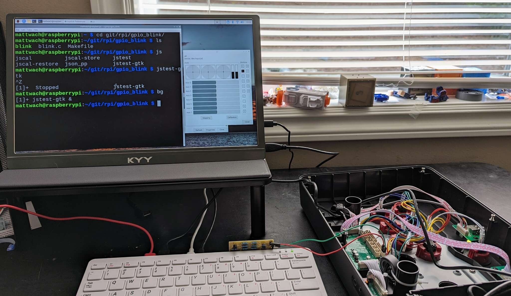
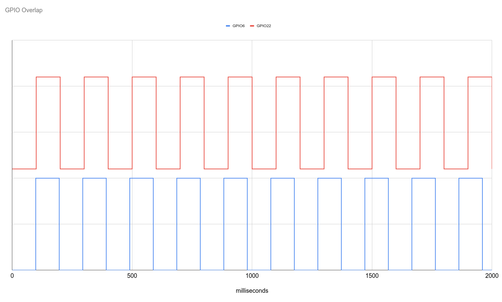
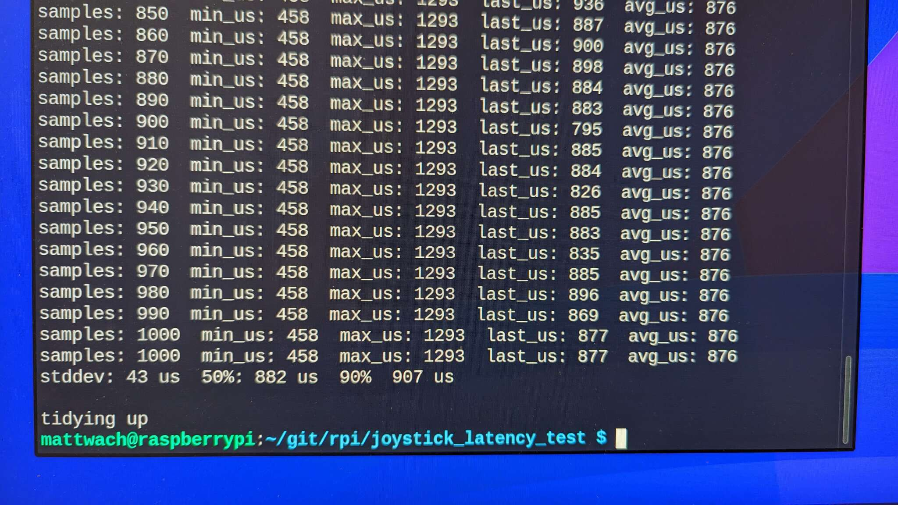
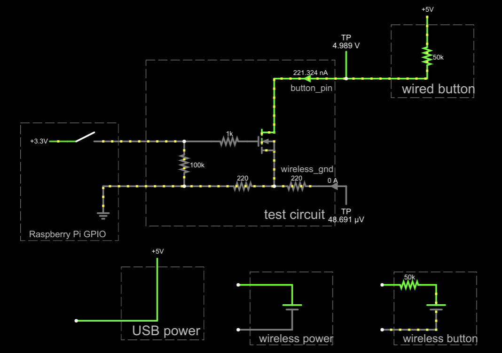
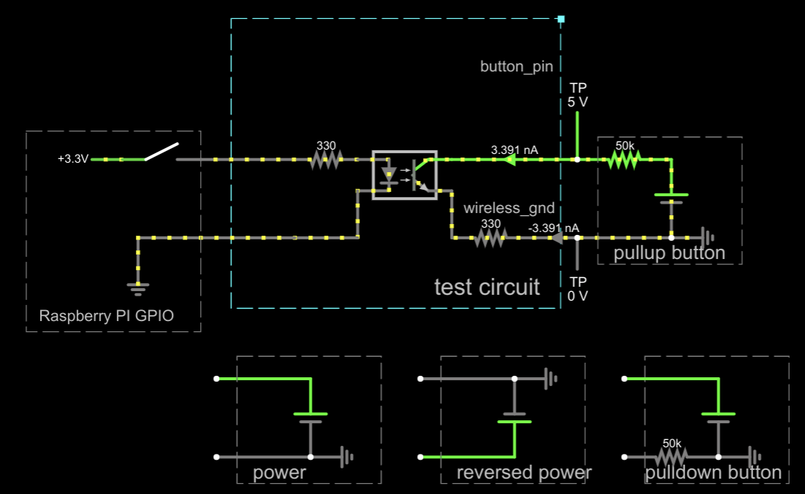

# game_controller_latency_tester

This project provides a (couple of) hardware designs for interfacing a game
controller to a rasperry pi (or similar) and automatically measuring the input
latency.

## What is input latency?

The "input latency" I'm referring to in this document is the amount of time
that passes between a button being pressed on the controller and application
(game) receiving the event.

This is the sum of all of the following:

   1. The game controller hardware signaling that the button is pressed
      (very fast)
   2. The game controller firmware processing this signal into a USB or
      bluetooth message (varies)
   3. The host USB/bluetooth hardware receiving the message and notifying the
      host operating system (usually fast)
   4. The host operating system handling the message and passing it forward to
      the application (usually fast)

> "button" could also mean deflecting a stick.

## Raspberry PI verses Microcontroller Test Setup

Some setups, such as [this one](https://inputlag.science/controller/methodology)
use microcontroller hardware to handle #1, #3 and #4.  This project uses a
Raspberry PI instead.

One reason to use a microcontroller is more control over the environment.  A
Raspberry PI running Linux could get interrupted in the middle of a measurement
which would unfairly penalize the result.  That said, the PI has many
advantages as well:

   1. Even though the Raspberry PI *could* get interrupted, it's fairly simple
      to create a environment where this is not likely to happen.  For example
      you could run without a graphical environment or any services.  My own
      tests didn't even bother being careful with this and still got similar
      results as the [microcontroller version](https://inputlag.science/controller/methodology)
      testing the [GP2040](https://github.com/FeralAI/GP2040) firmware.
   2. The Raspberry PI could be argued a more relevant test in some respects
      as it's using the same path that [RetroPie](https://retropie.org.uk/) would use.
   3. Supporting different configurations is much easier with Raspberry PI.
      For example, testing a bluetooth-based controller generally requires no
      additional hardware or setup.

## Other hardware options.

If Raspberry PI's are still hard to find, there are many alternative options.
The needed requirements are GPIO support and USB.  You *could* use a generic
PC with a USB to GPIO converter to send the needed trigger signals.  Something
like [this](https://www.adafruit.com/product/2264) or make-your-own with a PI Pico.

> Not using a raspberry pi will likely require some tweaks to the
> provided source code.

From this point forward, I'll refer to the Raspberry PI as the "host computer"
in case you opt to use an alternative.

## Process Overview

   1. The host computer toggles a GPIO and notes the current time in microsecond
      resolution.
   2. The GPIO signl the controller to think a button was pressed (or a stick
      was deflected)
   3. The controller sends a corresponding USB/Bluetooth message back to the
      host computer
   4. Upon receiving the USB/Bluetooth message, the host computer notes how much
      time has passed since sending the GPIO

1-4 repeats many time (1000 or more) to build up statistics.

## Test Pattern

One test pattern would be to toggle the GPIOs very fast, like 1000 times per
second.  But since no human player could ever do this, it could be argued that
the test is for something that can not happen in real use thus poor results
in these setups might not be reflect the real-world experience.

This tests tries to set up a more "real world" situation but toggling two GPIO
channels at 10Hz (or 20 inputs per second).  The way this is implemented is to
toggle GPIO1 every 100ms and GPIO2 every 98ms.  This creates a pattern that
looks like this:

## Interpreting the results

The reported statistics will be as follows:

   * Median Latency: The "middle" latency value where half of the samples are
     larger and half of them are smaller.
   * Standard Deviation: A measure of latency variance.
   * 90% latency: A pessimistic-but-reasonable way to think about the latency
     It basically says that 90% of the time, you'll see less latency than the
     reported number.

### What is "bad" latency?

At 60 Hz, a video frame is (around 16ms).  So if your controller latency is > 16ms, then you will lose a frame due to the controller every time.  If your
latency is 8ms, you will lose a frame about half the time, and so on.

As far as how important a missed frame is, I invite you to draw your own
conclusions.  But here are some sources:

[This reaction time test](https://humanbenchmark.com/tests/reactiontime) shows
humans to be around 200ms on average.

But there is more to gaming that pure reaction.  Most games offer "cues" or
"tells" that are followed by predictable patterns.  Some games are fully
predictable, like playing a song.  When events can be predicted and tracked, it
becomes less about reaction time and more about "temporal precision".
[This particular study](https://jov.arvojournals.org/article.aspx?articleid=2213289)
measured temporal precision at just 6ms for some activities.

So it depends on many things but the studies above suggset there are cases
where low latency "matters" in terms of giving a player an additional advantage
at some games.

## Hardware

Let's start with the most stright-forward hardware approach. You *could* directly
connect a PI GPIO to a controller and in many cases it will work, but
there are risks:

   1. The Raspberry PI is 3.3V, the controller might be something different, such
      as 5V.  This voltage mismatch could damage the GPIO hardware of the PI.
   2. Connecting the PI to some unknown input could easily lead to situations
      where the PI is trying to power a ground connection to 3.3V or
      "current sink" a powered connection to ground.  These situations can
      lead to the controller and/or PI getting damaged.

Thus I suggest using protection circuitry to keep the PI and controller
isolated from each other and reduce the risks of damage.  I present two
protection designs: optocoupler based, and NFET based.

### NFET Design

[Playground Link](http://www.falstad.com/circuit/circuitjs.html?ctz=CQAgjCAMB0l3BWcMBMcUHYMGZIA4UA2ATmIxAUgoqoQFMBaMMAKACURjCRMUQAWPDwx8qVflWzRsUWTAQsA5uEKSEfMKoFw5LAE4hs6w8f6F+J0TzQsA7gPM88QsxaOiWAZ07deKqn5UEABmAIYANp50+oaQFn64bsZB8HB2sfEilsIe9onZ7tmQLABGFFlgmDzY3PwoMsU1QgjEGlotfFy6TRSt2R3aYlAs2Bi0fZrijpPg3WO9fIUI-EkaugAeAmYCYLTLOzLxFgAudJ7HADqeAMYAlnrXAK63xyyb-MQyYAQUhOTfSAsmhAJUex2OAHsAHYAfQADrcoW8BBhuNgqggSIZcAIVCBbPc6OEzp4YYooQATdggHDcPBUWmGKziWhyKDQBQGRn0mk1fyySjwdKMmYDGbFMp-PiOPBgYjgYgWYqbEgQb50lBqvDyo74wkUq6g8HQljBHa+LKuHJM8Ac9mQFAxQp+fjAwLINKbTUQQjfbHSzW4lAWACqAGUAEJXOEQ2x0PSlBV8D5o7DywhEYb2FCYhbgSp54ocHPcAYlhxK2QSahDeQsABuNOMqiEGGM6iEQ2rSFrHMTf3IlCQBAshCMWab0vwIEIuZbwxVnxnOII3DHhx4VAJeiJJMNYMhSK57ZQQlnpdPAtS6StMyt5eKBitSxWRWsyoEo2XtCx66DW8JYlPE8aNY3jG8unnCQqHnCUBEDIdfjPcdikbFMZ2ndCOzZbs2TrewsMvaCKEvD8iP4L5HBWWo8TYUJPDhEp4z0ABPK4AAVbiuABxdiAEkAHlEzAQ4PnAPByHqeVinsGYEjia0ZIybIZkKYogA)

The NFET design has the advantage of easier hookup and faster operation.  The
disadvantage is that it will only work with ["pull up
resistor"](https://learn.sparkfun.com/tutorials/pull-up-resistors/all) style
buttons. If you unknowingly hook it to something else by mistake, no
damage will occur but the test will not be able to execute.  Pullup
configurations are more commonly used in design but some designs may have
reasons (or arbitrarily) decided to implement their buttons dfferently.

Another advantage of the FET, assumed pull up configuration is that the USB
cable (on USB controllers) can be used as the ground connection for the
test - this simplifies wiring and eliminates some types of wiring errors.

### Opcocoupler Design

[Playground Link](http://www.falstad.com/circuit/circuitjs.html?ctz=CQAgjCAMB0l3BWcMBMcUHYMGZIA4UA2ATmIxAUgoqoQFMBaMMAKACVxCq09wwUQPKMIAsVbNGzCqMBCwDm4DIUF5eYZSGzYVMlgHcQI4ipRijJ1b0gsAzp275B5oVQgAzAIYAbW3RYARiBc5IQighgQOno6vIRmgk7x4WAi4TGEcQkoasEJ2rpQLNgYVMmJvMamThAxpXnhObwImk3g0iwAHkYYvNgiKgh4Kv3ERs4gAC50tpMAOrYAxgCWAE6LAK7Lk10UKEjMzaTgKBApKgEbk5MA9gB2APoADst3u5S8RFJcEEQq5yB9Gs6N4ZrYHvI7gATFirLQ6CpGOCI8S4FgANxAyma-CxmSM2AEMiR1GJskCwWIUjEYzw5gQ2DGNkM2IJAkIGAEIkJRW6JCkDPCeG0FBK4zQICeG283ihN30dwWl2u91heJx7M5FFxtHgNjhVSsFFauVRNm6lAgguC2GaYsaVFWdHRdFWfihCye8tdBgoXG1XLCAaKQREeCQNJtAgZTIxfqo3Oj-oQOtEtGkUGgckMCH9iaMQfzNjE5DEjkqliErEMZecCeRbWZSO4uQKRqb2AQXJ5+3+PJsmM70dxQ7ZGfpGfJQUwpcgYxECRjRUMo5TAl7wfNgipovC-XIDNLiUl3tWas55YaKJo8F2hEIUTAVCwSGwYGpx6lMo2TyVV1ubwshKbTlI2FJhAc4ZYsQAhvkgA5YsBuQXte9aktIWYKOqwZ4Mia4dIoKFtBgXbtkUiiriOdKbuR8ZjggMFjnoK4Im0GimKavpmJebauLsJFaDgggjpoAJsJ4thPAErqrAAngsAAKACSCwAOLKQA8hS3FaNR8RKLGQA)

The optocoupler based design will work with either pull up or pull down
configuratons, but you need to known which way the current flows through the
button and connect two wires per button. Getting any of this wrong
should not do any damage, but the test will fail to execute.  Optocouplers
are also quite a bit slower than FETs.  The one I had on-hand took around 2us
to activate and 100+us to turn itself off.  You can get faster ones, but need
to look at the datasheet when you pick one.  In comparison, FET's just take
a handful of ns to turn on/off.  

Going forward, I'll assume we are going with the NFET design.  If you need
the optocoupler one, then your hardware build will be different but the
softare you run will be the same.

## Hookup example

## Software Tools

Most of the tools you will build as a part of this project.  The process is
to type

    Make

The standard Raspberry PI image should already contain what you need VERIFY THIS.

### jstest-gtk

These are commonly availabe tools.  e.g. in Ubuntu you can just say

    sudo apt install jstest-gtk
    
to install the software.  This software can be used to verify that your
controller is connected and working.  It can also tell you the device number
(which is often /dev/input/js0 if you only have one connected).

### toggle_test

This is a built tool.  You run it like this

    ./toggle_test

The test simply toggles GPIO6 and GPIO22 every second.  If you have jstest-gtk running
and the hardware all hooked up, you will ideally see the software reporting that
buttons are being pressed.

### joystick_events

This utility is a less-advanced commandline variant of jstest-gtk.  You may not
need to run it at all but it can be useful as an alternative tool.  Usage is
simple:

    ./joystick_events

The tool assumes the device is `/dev/input/js0`.  This can be changed in `joystick_events.c`

### simple_latncy_test

This is a single-channel version of the test that only uses GPIO22.  In my
testing, it gives the best-looking results, especially in standard deviation.
It works by toggling a gpio, waiting for the response, then toggling another
one.  So it's a bit easier on teh firmware than `multichannel_latency_test`.
Usage is again simple:

    ./simple_latency_test

### multichannel_latency_test

This version uses GPIO6 and GPIO22, toggling them in overlapping ways.  Usage
is again simple:

    ./multichannel_latency_test

### Example Results

